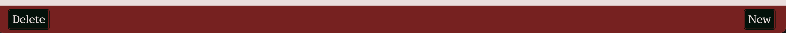
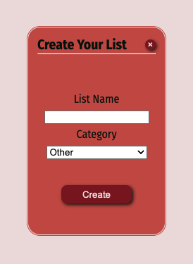
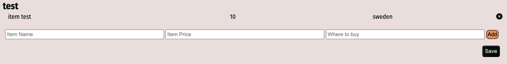
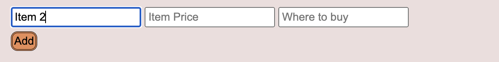

# PIN HEAD LISTS

Pin Head Lists is a place for anyone to create various lists and store them locally. It offers an easy way to list items that you need to buy and where to buy them, as well as price for the item. Alternatively, you can use to list tasks that need to be tracked of. 

The page is fully responsive and allow the user to create new lists, add new items, delete items and delete lists all together.

//responsive picture//

## Features

The page is a helper for anyone who wants/needs to remember things they need to buy, where to buy them, and the price at the moment. It works as a task manager too as the price and where to buy fields are not mandatory, so the user can simply add what the need to do and delete them as they complete the task.

### Existing features

+ Logo and Header
    + The logo with the page name is located in the top left corner, easily visible when first opening the page. The "My Lists" button is also located in the header opposite to the logo/name and it is easy to now that there is the place were the user will navigate through lists.

    

+ Footer
    + In the footer there are three buttons with tag "Delete", "New" and "Save" indicating that a list can be deleted, a new one can be created and the edited list must be saved;

    

+ Popup for list creation
    + When opening for the first time, the popup will automatically open. If not first time, the user must click on the new button for it to open. A tooltip appears not allowing the user to create a 

    

+ Add item layout
    + After creating a new list, the list name will be displayed on top and the form for creating a new item will show togehter with a add button that will appear desabled at first. When item is given a name, the "add" button becomes enabled and inserts the newly created item above the input form with a "x" at the end, indicating that the item can be removed, and becomes disabled again.

    
    

### Features left to implement

+ A few features are left to implement in further work on this:
    + User being able to reorganize and edit the items in the list;
    + Edit list title;
    + Smother transitions when deleting an item;
    + Sum of all the prices when provided;
    + List types: to-do lists and shoppping lists;

## Testing

BUGS:
bug: when creating item, it was not showing users input/ fix: place variables on the right place, inside the event listener.

bug: remove button not applying on all button, only on the first one/ fix: iterate through buttons everytime the user add a new item;

bug: in the dropdown menu with the created lists names, editing and saving the list was adding the event listener again to that element./ fix: attach a custom property to the element to indicate that the event listener is already in place, thus not adding again.

bug: when new list created, all the event listeners that were added after a list was created, were added again, this way creating duplicates when adding items, saving lists and so on. /fix: reload the page everytime a new list is created, ensuring that the event listeners are added only once.

bug: save button was saving the items on the last created list instead of the one the user was editing. /fix: remapping the save button each time a list is retrieved by cloning the button and adding the event listener again.

## Deployment

## Credits
### Content

+ The icon and favicon was taken from [Icon Archive](https://www.iconarchive.com/);
+ Information on how to use local storage on browser was taken from [thedevlife video](https://www.youtube.com/watch?v=xGvhj-f6IgQ&ab_channel=thedevlife) on YouTube;
+ Delete item icon was taken from [Font Awesome](https://fontawesome.com/);
+ Background picture taken from [Pexels](https://www.pexels.com/);

### Tools
+ [Coolors](https://coolors.co/) was used to create a color pallet;
+ [W3Schools](https://www.w3schools.com/) was used to help creating dropdown menu

