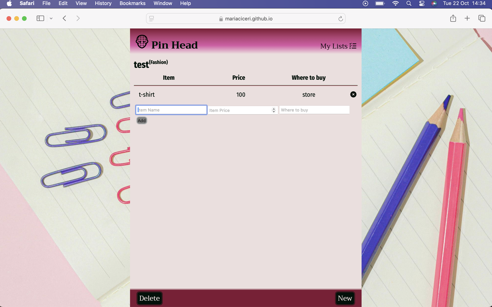
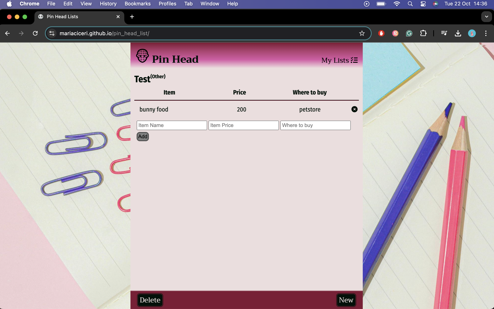

# PIN HEAD LISTS

Pin Head Lists is a place for anyone to create various lists and store them locally. It offers an easy way to list items that you need to buy and where to buy them, as well as price for the item. Alternatively, you can use to list tasks that need to be tracked of. 

The page is fully responsive and allow the user to create new lists, add new items, delete items, delete lists all together and navigate through created lists.

## Features

The page is a helper for anyone who wants/needs to remember things they need to buy, where to buy them, and the price at the moment. It works as a task manager too as the price and where to buy fields are not mandatory, so the user can simply add what they need to do and delete them as they complete the task.

### Existing features

+ Logo and Header
    + The logo with the page name is located in the top left corner, easily visible when first opening the page. The "My Lists" button is also located in the header opposite to the logo/name and it is easy to now that there is the place were the user will navigate through lists. The header is always visible.

    

+ Footer
    + In the footer there are three buttons with tag "Delete", "New" and "Save" indicating that a list can be deleted, a new one can be created and the edited list must be saved;

    

+ Popup for list creation
    + When opening for the first time, the popup will automatically open. If not first time, the user must click on the new button for it to open. A tooltip appears not allowing the user to create a list with a name that already exists;

    
    

+ Popup for delete list
    + When the user click on the delete button, a popup window will prompt the user to confirm the deletion;

    

+ Add item layout
    + After creating a new list, the list name will be displayed on top with the category on the top-right side of it, and the form for creating a new item will show togehter with a add button that will appear desabled at first. When something else than space is in the input field for name, the "add" button becomes enabled and, if clicked, inserts the newly created item above the input form with a "x" at the end, indicating that the item can be removed, and then the add button becomes disabled again.

    
    

+ My Lists dropdown menu
    + When more than one list is created, the user will navigate through then by clicking on the "My Lists" element. It will show all the names of the lists created so far with an arrow at the begining. By clicking in the list name, the page will display the items of that list.

    

### Features left to implement

+ A few features are left to implement in further work on this:
    + User being able to reorganize and edit the items in the list;
    + Edit list title;
    + Smother transitions when deleting an item;
    + Sum of all the prices when provided;
    + List types: to-do lists and shoppping lists;

## Testing

+ To ensure that the webpage works on all platforms and is responsive on different devices, a series of tests were run:

### Compatibility

+ The page was tested on Chrome, Firefox and Safari. All browsers had the functionalities operating properly. The page was opened in two different computers with different operational systems, a tablet and a phone. The tests performed were manual:
    + Create list button clicked:
        + Closes create list popup window and display list title input, display creating item form and add button;
    + Close button for create list popup window:
        + Closes the popup displaying again whatever is behind;
    + New button:
        + Opens create list popup window;
    + Delete button:
        + Opens confirmation popup window;
    + Delete confirmation popup Yes button:
        + Deletes the current list and display the last one created, if none, prompts the user to create a new one;
        + Display an alert saying that the list was deleted;
    + Delete confirmation popup No button:
        + Closes the popup window showing whatever is behind;
    + Save button:
        + Display an alert saying that the list was saved;
    + My Lists button:
        + Show dropdown menu with all list names created so far;
    + Add button:
        + Insert item in the HTML with the input information provided;
    + X button next to added items:
        + Erase item from HTML;

### Validation

+ HTML
    + No errors were found when running the page on the [W3C HTML valitor](https://validator.w3.org/)
    + Two warnings were present in the validation and this regards the present of empty elements.
        +  The cause of this is because this elements will be filled later with user input;

+ CSS 
    + No errors were found when passing the code through on the oficial [W3C CSS validator](https://jigsaw.w3.org/css-validator/)
    + Three warnings were present.
        + The warnings refers to the CSS variable for the font family and it does not affect the use of the font;

+ JavaScript
    + No error was found when running all my JavaScript files on [JSHint](https://jshint.com/)

### Lighthouse

+ Using lighthouse in dev tools to confirm that the overall performance is efficient and accessible and colors and fonts chosen are readable.

### Bugs
    
+ Bug: when creating item, it was not showing users input;
    + Fix: place variables on the right place, inside the event listener.

+ Bug: remove button not applying on all button, only on the first one;
    + Fix: iterate through buttons everytime the user add a new item;

+ Bug: in the dropdown menu with the created lists names, editing and saving the list was adding the event listener again to that element;
    + Fix: attach a custom property to the element to indicate that the event listener is already in place, thus not adding again.

+ Bug: when new list created, all the event listeners that were added after a list was created, were added again, this way creating duplicates when adding items, saving lists and so on;
    + Fix: reload the page everytime a new list is created, ensuring that the event listeners are added only once.

+ Bug: save button was saving the items on the last created list instead of the one the user was editing;
    + Fix: remapping the save button each time a list is retrieved by cloning the button and adding the event listener again.

## Deployment
### Deployment to Github Pages
+ The page was deployed in the early stages to GitHub pages. The steps to deploy are as follows:
    + In the GitHub [repository](https://github.com/mariaciceri/pin_head_list), navigate to the Settings tab;
    + On the right-hand side in the menu, click on pages;
    + In Source check if "deploy from branch" is selected, then below it, in Branch, select "main" and save it;
    + To access it for the first time, go back to Code in the main navbar and on the left-hand side scroll down to deployments, click there and open the page;

### Local deployment
+ In order to make a local copy of this project, you can clone it. In your IDE Terminal, type the following command to clone my repository:

git clone https://github.com/mariaciceri/pin_head_list

## Credits
### Content

+ The icon and favicon was taken from [Icon Archive](https://www.iconarchive.com/);
+ Information on how to use local storage on browser was taken from [thedevlife video](https://www.youtube.com/watch?v=xGvhj-f6IgQ&ab_channel=thedevlife) on YouTube;
+ Delete item icon was taken from [Font Awesome](https://fontawesome.com/);
+ Background picture taken from [Pexels](https://www.pexels.com/);
+ Info button idea was taken from [Codepen](https://codepen.io/EasyBoarder/pen/LZzzjy)

### Tools
+ [Coolors](https://coolors.co/) was used to create a color pallet;
+ [W3Schools](https://www.w3schools.com/) was used to help creating dropdown menu;

